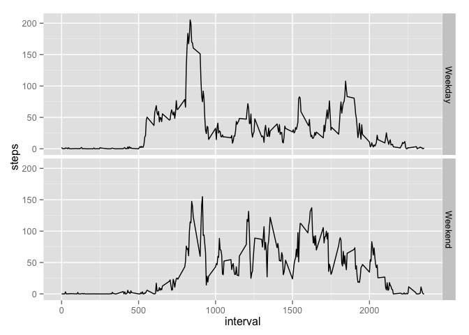

# RepData_PeerAssessment1
Amasa Amos  
October 19, 2014  

## Loading and preprocessing the data


```r
unzip('activity.zip')
colClasses <- c('integer', 'Date', 'integer')
activity <- read.csv('activity.csv', colClasses = colClasses)
library(data.table)
activity <- data.table(activity)
```

## What is the mean total number of steps taken per day?


```r
total_steps_per_day <- activity[,list(steps=sum(steps, na.rm=TRUE)), by=date]$steps
hist(total_steps_per_day,
     main = 'Histogram of Total Number of Steps Taken Per Day',
     xlab = 'Total Steps Per Day')
```

 

```r
mean_steps <- mean(total_steps_per_day)
median_steps <- median(total_steps_per_day)
```

The mean total steps per day is 9354.2295082.

The median total steps per day is 10395.

## What is the average daily activity pattern?


```r
avg_steps_per_interval <- activity[,list(steps=mean(steps, na.rm=TRUE)), by=interval]
with(avg_steps_per_interval, { plot(interval, steps, type='l',
                                    main='Mean Steps Per Interval') })
```

 

```r
max_interval <- avg_steps_per_interval[max(steps),]$interval
```

The 5-minute interval which contains the maximum number of steps (on average) is interval 1705.

## Imputing missing values


```r
missing_values <- which(is.na(activity))
missing_value_count <- length(missing_values)
```

There are 2304 missing values in the dataset.


```r
median_steps_per_interval <- activity[,list(steps=median(steps, na.rm=TRUE)), by=interval]
imputed_activity <- activity
for (row in missing_values) {
    imputed_activity[row]$steps <- median_steps_per_interval[interval==activity[row]$interval,]$steps
}
imputed_total_steps_per_day <- imputed_activity[,list(steps=sum(steps)), by=date]$steps
hist(imputed_total_steps_per_day,
     main = 'Histogram of Total Steps Taken Per Day (Imputed)',
     xlab = 'Total Steps Per Day (Imputed)')
```

 

```r
imputed_mean_steps <- mean(imputed_total_steps_per_day)
imputed_median_steps <- median(imputed_total_steps_per_day)
mean_difference <- imputed_mean_steps - mean_steps
median_difference <- imputed_median_steps - median_steps
```

The imputed mean total steps per day is 9503.8688525. This is a difference of 149.6393443 mean steps from the estimate.

The imputed median total steps per day is 10395. This is a difference of 0 from the estimate.

## Are there differences in activity patterns between weekdays and weekends?

```r
imputed_activity$day <- factor(weekdays(imputed_activity$date) %in% c('Saturday','Sunday'))
levels(imputed_activity$day) <- c('Weekday', 'Weekend')
avg_steps_by_day <- imputed_activity[,list(steps=mean(steps, na.rm=TRUE)), by=list(day,interval)]
library(ggplot2)
ggplot(avg_steps_by_day, aes(interval, steps)) + geom_line() + facet_grid(day ~ .)
```

 
